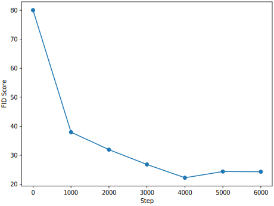

# Stable Diffusion 3 Fine-Tuning and Feature Visualization

## Workflow

The flowchart below summarizes our project workflow. The dataset was derived from CelebA-HQ and CelebA, with prompts generated using BLIP-2 and Llama 3. Selected Transformer blocks of the model were fine-tuned with LoRA. We then analyzed the results quantitatively through FID scores and qualitatively using NCUT and heatmap visualizations.


## Results

### FID Scores

We conducted three fine-tuning experiments using different means for the logit-normal distribution in timestep sampling. Images were generated with the pretrained model and the three fine-tuned models using prompts from the validation set, and their FID scores were calculated against the ground-truth images. The table below shows the results. The best FID score was 24.3, a significant improvement over the pretrained model's 80.0.

| Model                      | BLIP-2 Captions | Llama 3.1 Captions |
| -------------------------- | --------------- | ------------------ |
| Pretrained                 | 80.0            | 88.2               |
| Fine-Tuned with $m = -0.5$ | **24.3**        | 31.1               |
| Fine-Tuned with $m = 0.0$  | 29.8            | 31.0               |
| Fine-Tuned with $m = 0.5$  | 32.0            | 31.6               |

The plot below shows how the validation set FID score changed over the training steps. The score improved steadily at first and plateaued around step 4000. The plot corresponds to our best fine-tuned model with $m = -0.5$.



To find the optimal inference setting, we adjusted the guidance scale from 1.0 to 7.0 and calculated the FID scores. The plot below shows the results, with the best FID score of 18.11 achieved at a guidance scale of 3.0.


## Installation

Clone this Git repository and install the package using pip:

```bash
pip install /path/to/sd3-lora-celeba
```

This will automatically install all dependencies, but you may prefer to install them manually to ensure compatibility with your system. Refer to [`pyproject.toml`](./pyproject.toml) for the complete list of dependencies.

To calculate FID scores, you will need to install the additional [`pytorch-fid` package](https://github.com/mseitzer/pytorch-fid):

```bash
pip install pytorch-fid
```

## Usage

This section outlines the essential steps to prepare the dataset, fine-tune the model, calculate FID scores, and visualize attention weights. For a complete list of commands and options, use `sd3 --help` and `sd3 <command> --help`.

### Download and Prepare the Datasets

Download the [CelebAMask-HQ dataset](https://github.com/switchablenorms/CelebAMask-HQ) and extract the `CelebAMask-HQ.zip` file to a directory of your choice. Run the following command to split the examples into training, validation, and test sets in a new directory:

```bash
sd3 prepare-celeba-hq /path/to/CelebAMask-HQ /path/to/dataset
```

We augment the dataset with additional images from the [CelebA dataset](https://mmlab.ie.cuhk.edu.hk/projects/CelebA.html). Download the dataset to a directory of your choice. Run the following command to add the filtered and cropped CelebA images to the training set:

```bash
sd3 prepare-celeba /path/to/CelebA /path/to/CelebAMask-HQ /path/to/dataset
```

### Caption the Images

First, caption the images using BLIP-2.

```bash
sd3 caption-blip2 /path/to/dataset
```

Then, generate more detailed captions using Llama 3 based on the BLIP-2 captions and the binary attributes from CelebA:

```bash
sd3 caption-llama3 /path/to/dataset
```

You may need to log in to Hugging Face and request access to the Llama 3 model.

### Compute Image Latent Distributions and Prompt Embeddings

Compute and save the latent distributions of the dataset images:

```bash
sd3 compute-latent-dist /path/to/dataset
```

Compute and save the text embeddings for the BLIP-2 and Llama 3 captions:

```bash
sd3 compute-prompt-embeds 1 /path/to/dataset
sd3 compute-prompt-embeds 2 /path/to/dataset
sd3 compute-prompt-embeds 3 /path/to/dataset
```

The numbers `1`, `2`, and `3` stands for the three text encoders CLIP-G/14, CLIP-L/14, and T5 XXL, respectively.

In addition to the text embeddings of the image captions, we also need the text embeddings of the empty prompt. Run the following commands to generate them:

```bash
mkdir /path/to/dataset/empty-prompt
touch /path/to/dataset/empty-prompt/prompt_empty.txt
sd3 compute-prompt-embeds 1 /path/to/dataset/empty-prompt
sd3 compute-prompt-embeds 2 /path/to/dataset/empty-prompt
sd3 compute-prompt-embeds 3 /path/to/dataset/empty-prompt
```

You may need to log in to Hugging Face and request access to the Stable Diffusion 3 model.

### Fine-Tune the Model

Fine-tune the model on the prepared dataset using the following command, which includes the best hyperparameters identified so far:

```bash
sd3 fine-tune /path/to/dataset/train /path/to/dataset/empty-prompt \
    --amp \
    --lora-blocks 4,5,6,7,8,9,10,11,12,13,14,15,16,17,18,19,20,21,22 \
    --lora-rank 64 \
    --learning-rate 1e-4 \
    --adam-weight-decay 1e-4 \
    --num-training-steps 6000 \
    --gradient-accumulation-steps 20 \
    --batch-size 3 \
    --lr-scheduler cosine \
    --lr-warmup-steps 500 \
    --weighting-scheme logit_normal \
    --logit-mean -0.5
```

The program may prompt you to log in to W&B for logging if you have not already done so.

### Calculate FID Scores

First, copy the ground-truth images from the test set to a new directory:

```bash
sd3 copy-images /path/to/dataset/test /path/to/fid/ground-truth
```

Then, generate images using the pre-trained and fine-tuned models:

```bash
sd3 generate-images /path/to/dataset/test /path/to/fid/pretrained
sd3 generate-images /path/to/dataset/test /path/to/fid/fine-tuned --lora-weight-dir /path/to/lora/checkpoint
```

Save the image statistics so we can reuse them for multiple FID computations:

```bash
cd /path/to/fid/ground-truth
pytorch-fid --save-stats . stats.npz
cd /path/to/fid/pretrained
pytorch-fid --save-stats . stats.npz
cd /path/to/fid/fine-tuned
pytorch-fid --save-stats . stats.npz
```

Finally, compute the FID scores for the pre-trained and fine-tuned models:

```bash
pytorch-fid /path/to/fid/ground-truth/stats.npz /path/to/fid/pretrained/stats.npz
pytorch-fid /path/to/fid/ground-truth/stats.npz /path/to/fid/fine-tuned/stats.npz
```

### Attention Weight Visualization

The following command starts a Gradio app that visualizes the attention weights using heatmaps and NCUT:

```bash
sd3 visualize-attention-weights \
    --lora-weight-dir /path/to/lora/checkpoint-1 \
    --lora-weight-dir /path/to/lora/checkpoint-2
```
